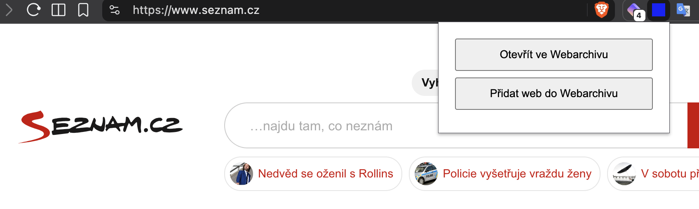

# webarchiv_extension

# Webarchiv Extension for Brave





Jednoduché rozšíření pro Brave/Chromium, které usnadňuje práci s českým Webarchivem.

Rozšíření umí:

- otevřít aktuální stránku ve Webarchivu,
- otevřít označenou URL ve Webarchivu,
- otevřít odkaz ve Webarchivu přes pravé tlačítko,
- otevřít formulář „Přidat web do Webarchivu“,
- automaticky předvyplnit URL aktuální stránky do formuláře,
- používat stejné funkce i přes připnutou ikonku v liště prohlížeče.

## Instalace

### 1. Stáhni repozitář

Na GitHubu klikni na:

**Code → Download ZIP**

ZIP rozbal do libovolné složky.

Například:

```text
webarchiv_extension/
├── manifest.json
├── background.js
├── popup.html
├── popup.js
└── icons/
    ├── icon16.png
    ├── icon48.png
    └── icon128.png
```

### 2. Otevři správu rozšíření v Brave

Do adresního řádku napiš:

```text
brave://extensions
```

### 3. Zapni režim pro vývojáře

V pravém horním rohu zapni:

**Režim pro vývojáře / Developer mode**

### 4. Načti rozšíření

Klikni na:

**Načíst rozbalené / Load unpacked**

Vyber složku, ve které se nachází `manifest.json`.

Například:

```text
webarchiv_extension
```

Rozšíření se následně zobrazí mezi nainstalovanými rozšířeními.

## Připnutí ikonky

Klikni v Brave na ikonu rozšíření v horní liště a rozšíření **Webarchiv** připni.

Po připnutí bude jeho ikona stále dostupná vedle adresního řádku.

## Použití

### Otevřít aktuální stránku ve Webarchivu

Klikni na připnutou ikonku rozšíření.

Vyber:

**Otevřít ve Webarchivu**

Například aktuální URL:

```text
https://example.com
```

se otevře jako:

```text
https://wayback.webarchiv.cz/secure/https://example.com
```

### Přidat aktuální web do Webarchivu

Klikni na připnutou ikonku rozšíření.

Vyber:

**Přidat web do Webarchivu**

Otevře se stránka:

```text
https://www.webarchiv.cz/cs/pridat-web
```

Rozšíření automaticky vloží URL původní stránky do pole pro přidání webu.

Zbytek formuláře už vyplní uživatel ručně.

### Pravé tlačítko na stránce

Na běžné webové stránce klikni pravým tlačítkem.

V kontextovém menu se zobrazí:

```text
Otevřít ve Webarchivu
Přidat web do Webarchivu
```

Volba **Otevřít ve Webarchivu** použije URL aktuální stránky.

Volba **Přidat web do Webarchivu** otevře formulář pro přidání webu a předvyplní aktuální URL.

### Pravé tlačítko na odkazu

Klikni pravým tlačítkem přímo na odkaz.

Volba:

**Otevřít ve Webarchivu**

otevře cílovou URL odkazu ve Webarchivu.

Volba:

**Přidat web do Webarchivu**

otevře formulář Webarchivu s URL daného odkazu.

### Označený text obsahující URL

Pokud je URL na stránce jen jako text, například:

```text
https://example.com/clanek
```

označ ji myší a klikni pravým tlačítkem.

Vyber:

**Otevřít ve Webarchivu**

Rozšíření označený text použije jako URL.

Pokud adresa neobsahuje `http://` nebo `https://`, rozšíření automaticky doplní:

```text
https://
```

## Aktualizace rozšíření

Pokud upravíš zdrojové soubory:

1. otevři:

```text
brave://extensions
```

2. najdi rozšíření Webarchiv,
3. klikni na ikonu:

**↻ Obnovit**

Není potřeba rozšíření znovu instalovat.

## Podporované prohlížeče

Rozšíření používá Chromium Extensions API a je primárně vytvořeno pro:

- Brave
- Google Chrome
- Microsoft Edge
- další prohlížeče založené na Chromiu

Primárně je testováno v Brave.

## Jak funguje předvyplnění URL

Po použití funkce **Přidat web do Webarchivu** rozšíření otevře oficiální formulář Webarchivu a pomocí content scriptu vloží původní URL do příslušného pole formuláře.

Rozšíření formulář samo neodesílá.

Uživatel má před odesláním možnost všechny údaje zkontrolovat a doplnit.

## Oprávnění

Rozšíření může používat například tato oprávnění:

```text
contextMenus
activeTab
tabs
scripting
```

Přístup k webu je omezen na:

```text
https://www.webarchiv.cz/*
```

Oprávnění slouží pouze k:

- vytvoření položek v kontextovém menu,
- získání URL aktuální stránky,
- otevření nové karty,
- předvyplnění URL ve formuláři Webarchivu.

## Soukromí

Rozšíření:

- neodesílá data na žádný vlastní server,
- nesbírá historii prohlížení,
- neobsahuje analytiku,
- neukládá osobní údaje,
- neposílá URL třetím stranám mimo služby Webarchivu, které uživatel sám aktivuje.

## Upozornění

Toto rozšíření není oficiálním produktem Webarchivu ani Národní knihovny České republiky.

Jde o nezávislý pomocný nástroj pro rychlejší práci se službami Webarchivu.


Doporučeno je přidat do repozitáře samostatný soubor:

```text
LICENSE
```
